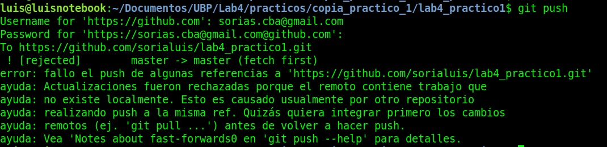
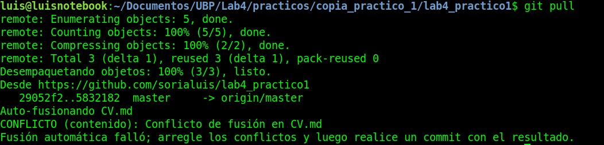
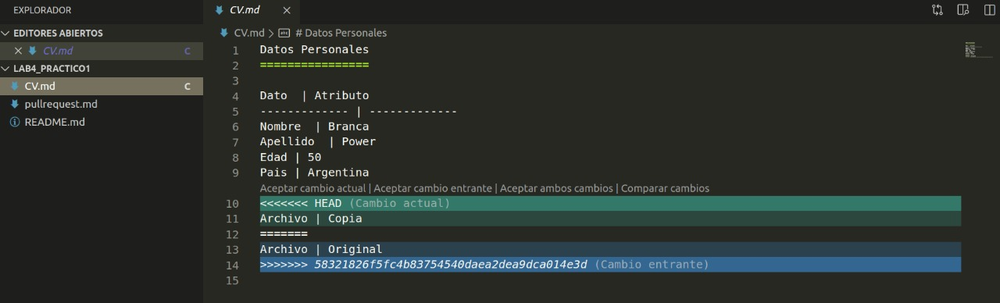
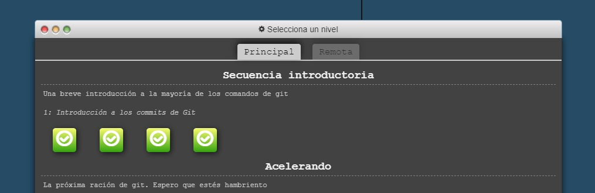

Resumen de Practico 1
=====================

En este practico se trabajo en el siguiente [repositorio](https://github.com/sorialuis/lab4_practico1). 

En donde se resolvieron los conflictos del punto 5 a travez de la terminal de linux y visual studio code.

- Aca intentamos hacer un push hacia el el repo en github pero detecta que en este repo remoto tiene nuevos cambios y por eso nos recomienda hacer un git pull.

- Luego de hacer el git pull nos da aviso que tenemos conflictos.

- Y los resolvemos desde visual studio code 

- Y se completaron los ejercicios de https://learngitbranching.js.org/

