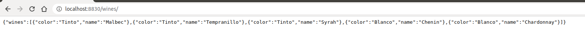
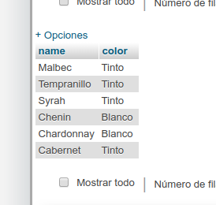
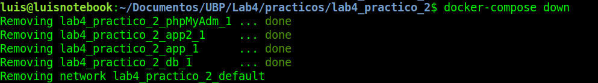
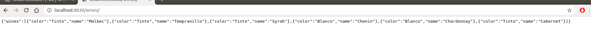

# Trabajo Práctico N° 2 
## ubp-docker-example

1. Agregar las variables de entorno necesarias para que la aplicacion "Flask" se conecte a MYSQL  
2. Agregar php my admin a este docker-compose, y agregar nuevos varietales en la tabla wines del esquema drinks  
3. Persistir el contenido de la base de datos mysql en disco  
4. Hostear dos contenedores con la aplicación flask en puertos diferentes en el host (no hay que cambiar la aplicación)  
5. Agregar al Dockerfile en ./app  la aplicación de linux "nano"

# Resolucion:

En este practico se trabajo en el siguiente [repositorio](https://github.com/sorialuis/lab4_practico2)

1. Se agrega un archivo .env en la raiz del proyecto con las credenciales y las variabes de entorno para el docker-compose.yml
2. En este punto se agregan nueva informacion en la base de datos desde phpmyadmin pero no persisten los datos.
3. Se agrega el volumen para que se persistan los datos en donde tenemos lo siguiente: 

- En primera instancia tenemos la api con estos vinos de base. 

- Agergamos en phpmyadmin un tipo de vino.  

- Damos de baja el los docker. 

- Y volvemos a darlos de alta pegandole a la misma api y encontramos el vino agregado por phpmyadmin, entonces tenemos la persistencia de datos.

4. En el docker-compose se generan 2 instancias de la app una al puerto 8829 y la otra 8830 en donde le paso 2 variables de entorno distintas para saludar.

5. Se instala vim en la app porque me gusta mas. =D